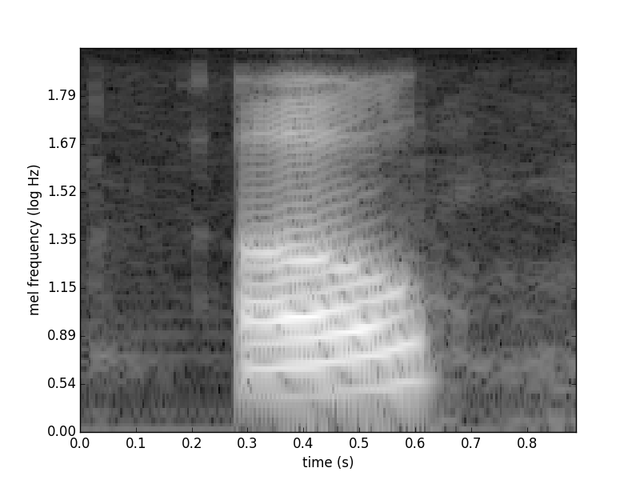

## Outline

* Data
* Convolutional Neural Networks
* Recurrent Neural Networks
* Data augmentation
* Results


## Data

* TIDIGITS dataset
    + Recording of >300 people speaking the digits 0-9
    + Split between men, women, and children
    + Digits are repeated a number of times and in a number of combinations
* We use subsample of 10 speakers: 5 male, 5 female
    + Each person repeats every digit twice
    + Training set: 6 speakers (3 male and 3 female)
    + Test set: 4 speakers (2 male and 2 female)
    + Model trained on 132 sample audio files, tests on 88

<center>
<audio controls>
  <source src="./wav_files/FEA_7A.wav" type="audio/wav" autoplay="false">
Your browser does not support the audio element.
</audio> 
</center>
<center>
 <audio controls>
  <source src="./wav_files/MBD_3B.wav" type="audio/wav" autoplay="false">
Your browser does not support the audio element.
</audio> 
</center>

## Data pre-processing

* Cropping silence
* Padding
* Normalising

## Convolutional Neural Networks
Recall ANN

<center>

</center>


* too many parameters
* overfitting
* not scalable with large datasets

---

* Local features
* Translational invariance features (can occur at different position in the image)
* High-level features composed by low-level features

<center>


	
## Convolution 
<center>
	
	
</center>


<div class="columns-2">
* Receptive Field
* Stride
* Padding
* ReLU: $\max\{0, x\}$


</div>

## Max Pooling

* Reduce spatial size of the representation
* Filter size [2x2], with stride of 2
* Discard 75 % of the activations

<center>
	
	
</center>

## Overall Architecture

* Input layer
* Convolution layer 
* Fully connected layer

<center>

## Waveform

<div class="columns-2"> 
* raw signal
* 8000 Hz
* cropped and centered

  
</div>


## Spectrogram

<div class="columns-2"> 
  
  
</div>


## Mel-Frequency Basis

<div class="columns-5"> 
  
   
  
   
  
</div>

# Models

## CNN model

1. 4 x 4 convolution
2. 4 x 4 convolution
3. 2 x 4 max-pooling
4. three pairs of 
    - 4 x 4 convolution
    - 2 x 2 max-pooling
5. A dense layer of 128 units
6. A dense layer of 11 units (for classification)

Each layer uses ReLU for the activation, except the final classification later, which uses softmax.

## RNN model
- first uses a convolution component, similar to the CNN model, to reduce the size of the spectrogram in the frequency domain
    - reduce the frequency domain by a factor of approximately 2^6 and the time domain by a factor of 4
- then, an LSTM with 256 units is used to iterate through the time domain
- final layer of LSTM fed into a fully connected layer reducing this to 11 modes, which as input to the softmax function for classification

# Results

## CNN Initial Settings
- train on six speakers, test on four speakers
- settings
  - batch size - 4
  - epochs - 12
  - loss function - categorical-cross-entropy
  - optimiser - adadelta
  
## CNN Results
- ran six times
  - 5 results in 0.875-0.9432
  - 1 result of 0.0909

<center>
```{r, echo=FALSE, fig.height=4}
library(ggplot2)

cnn_2d_results <- data.frame(
  epoch = rep(1:8, 8),
  values = c(6.6163, 2.2952, 1.5238, 0.7705, 0.5397,
            0.4187, 0.3722, 0.3483,
            0.1515, 0.3106, 0.6061, 0.8939, 0.9773,
            0.9924, 1.0000, 1.0000,
            2.1955, 1.7771, 1.0873, 0.6364, 0.5256,
            0.4574, 0.4709, 0.4610,
            0.2273, 0.3636, 0.6932, 0.8068, 0.8295,
            0.8295, 0.8636, 0.8636),
  key = as.factor(rep(c("loss", "acc", "val_loss", 
                        "val_acc"), each = 8))
                          )
plot_df <- subset(cnn_2d_results, key == "acc" | key == "val_acc")
cnn_2d_plot_acc <-  ggplot(data = plot_df, aes(x = epoch, y = values, 
                                            group = key, colour = key))
cnn_2d_plot_acc <-  cnn_2d_plot_acc + geom_line() + geom_point() + theme_bw() +
  scale_color_brewer(palette = "Dark2" ) +
  theme(panel.background = element_rect(fill = "transparent",colour = NA))
cnn_2d_plot_acc
```
</center>

## Cross-Validation
- LOOCV
  - 5 folds have test accuracy in 0.8636 - 1
  - 5 folds have test accuracy 0.0909
  
  
## Dropout and Augmentation
- Experiment with adding dropout layers to prevent overfitting
  - no appreciable improvement in test accuracy
- Augment the training set by introducing 10 copies of each sample, with each of these audio signals shifted by a small amount
  - some improvement in test score, but still wide range (0.8750 - 0.9659)
  - LOOCV still has five folds with 0.0909

## Optimisation Tuning
- Possible that high losses due to a learning rate that is too high
- Switch to Stochastic Gradient Descent, run for 20 epochs
- LOOCV average test accuracy 0.8636
- Test accuracy in the folds ranged from 0.4545 to 1.

## RNN results
- One run on unaugmented data using SGD optimiser and 100 epochs
- Test accuracy of 0.8864

<center>
```{r, echo=FALSE, fig.height=4}
rnn_2d_results <- data.frame(
  epoch = rep(1:100, each=4),
  values = c(
    2.4524, 0.0909, 2.4137, 0.0909,
    2.4097, 0.0909, 2.3883, 0.1136,
    2.3812, 0.1515, 2.3661, 0.1477,
    2.3620, 0.1212, 2.3560, 0.2045,
    2.3499, 0.1970, 2.3305, 0.2386,
    2.3280, 0.2652, 2.3123, 0.2273,
    2.3080, 0.2424, 2.3032, 0.2159,
    2.2821, 0.2576, 2.2718, 0.3068,
    2.2645, 0.2955, 2.2715, 0.2841,
    2.2583, 0.2803, 2.2459, 0.2841,
    2.2261, 0.2803, 2.2088, 0.4091,
    2.1878, 0.4167, 2.1744, 0.3750,
    2.1544, 0.3182, 2.1812, 0.2614,
    2.1565, 0.3030, 2.1563, 0.3295,
    2.1169, 0.3636, 2.1094, 0.2955,
    2.0612, 0.3258, 2.0706, 0.3523,
    2.0167, 0.3788, 2.0886, 0.3182,
    2.0438, 0.3182, 2.1209, 0.2955,
    2.0941, 0.3258, 2.1678, 0.2386,
    2.1004, 0.2727, 2.2268, 0.1591,
    2.1983, 0.1136, 2.1780, 0.2386,
    2.1290, 0.2955, 2.1137, 0.2955,
    2.0590, 0.4242, 2.0544, 0.3409,
    1.9918, 0.4318, 1.9912, 0.3864,
    1.9174, 0.4697, 1.9181, 0.4091,
    1.8290, 0.4318, 1.8440, 0.5000,
    1.7353, 0.5530, 1.8569, 0.4091,
    1.7162, 0.5152, 1.8910, 0.3068,
    1.8563, 0.2879, 2.1656, 0.3182,
    2.0653, 0.3409, 1.9255, 0.3523,
    1.8524, 0.3561, 1.8218, 0.4432,
    1.7213, 0.5227, 1.7668, 0.4886,
    1.6203, 0.5530, 1.7199, 0.5000,
    1.5798, 0.6288, 1.6671, 0.4886,
    1.4969, 0.5606, 1.6195, 0.5114,
    1.4344, 0.6212, 1.5395, 0.5114,
    1.3336, 0.6515, 1.5943, 0.5568,
    1.3854, 0.6288, 1.5725, 0.5227,
    1.4388, 0.6061, 1.5736, 0.5000,
    1.3418, 0.5833, 1.3506, 0.6477,
    1.1753, 0.8106, 1.3507, 0.6364,
    1.1432, 0.7424, 1.4345, 0.5568,
    1.2973, 0.6288, 1.3438, 0.5341,
    1.1696, 0.6439, 1.2066, 0.6591,
    0.9693, 0.7955, 1.1856, 0.7386,
    0.9615, 0.7803, 1.2802, 0.6705,
    1.0348, 0.7727, 1.2016, 0.6705,
    0.9582, 0.8030, 1.0976, 0.7045,
    0.8730, 0.8409, 1.0269, 0.7273,
    0.8105, 0.8712, 0.9635, 0.7955,
    0.6956, 0.9545, 0.8958, 0.8295,
    0.6802, 0.9015, 1.0727, 0.6591,
    0.7356, 0.8258, 1.0635, 0.7159,
    0.8838, 0.7803, 1.4489, 0.5455,
    1.1147, 0.5909, 1.1047, 0.6818,
    0.8553, 0.8030, 1.1653, 0.6136,
    0.8705, 0.7652, 1.1818, 0.6250,
    0.9303, 0.7273, 0.9958, 0.7386,
    0.6692, 0.9091, 0.9941, 0.7273,
    0.6462, 0.9545, 0.8857, 0.8068,
    0.6324, 0.8788, 0.9647, 0.7273,
    0.5889, 0.9091, 0.8244, 0.8182,
    0.5250, 0.9015, 0.7958, 0.8182,
    0.4503, 0.9394, 0.7480, 0.8068,
    0.3962, 0.9470, 0.6996, 0.8295,
    0.3566, 0.9773, 0.7000, 0.8182,
    0.3280, 0.9848, 0.6503, 0.8409,
    0.3038, 0.9924, 0.6763, 0.8182,
    0.2910, 0.9773, 0.6802, 0.7955,
    0.2997, 0.9697, 0.6521, 0.8182,
    0.2775, 0.9621, 0.7072, 0.7955,
    0.2930, 0.9621, 0.6203, 0.8295,
    0.2501, 0.9470, 0.5766, 0.8523,
    0.1906, 0.9848, 0.5619, 0.8523,
    0.1689, 0.9924, 0.5183, 0.8636,
    0.1505, 1.0000, 0.5238, 0.8523,
    0.1399, 1.0000, 0.5057, 0.8523,
    0.1295, 1.0000, 0.4978, 0.8750,
    0.1193, 1.0000, 0.4714, 0.8977,
    0.1108, 1.0000, 0.4915, 0.8409,
    0.1022, 1.0000, 0.4796, 0.8636,
    0.0939, 1.0000, 0.4783, 0.8636,
    0.0875, 1.0000, 0.4763, 0.8750,
    0.0816, 1.0000, 0.4707, 0.8750,
    0.0763, 1.0000, 0.4660, 0.8750,
    0.0715, 1.0000, 0.4586, 0.8750,
    0.0670, 1.0000, 0.4570, 0.8750,
    0.0631, 1.0000, 0.4505, 0.8750,
    0.0594, 1.0000, 0.4492, 0.8864,
    0.0561, 1.0000, 0.4452, 0.8864,
    0.0531, 1.0000, 0.4418, 0.8864,
    0.0503, 1.0000, 0.4385, 0.8864,
    0.0478, 1.0000, 0.4355, 0.8864,
    0.0456, 1.0000, 0.4322, 0.8864,
    0.0435, 1.0000, 0.4286, 0.8864,
    0.0415, 1.0000, 0.4274, 0.8864,
    0.0396, 1.0000, 0.4254, 0.8864,
    0.0380, 1.0000, 0.4225, 0.8864,
    0.0364, 1.0000, 0.4191, 0.8864,
    0.0349, 1.0000, 0.4157, 0.8864
    ),
  key = as.factor(rep(c("loss", "acc", "val_loss", "val_acc"), 100))
  )
                             
# 2D RNN acc plot
plot_df <- subset(rnn_2d_results, key == "acc" | key == "val_acc")
rnn_2d_plot_acc <-  ggplot(data = plot_df,
                           aes(x = epoch, y = values, 
                               group = key, colour = key))
rnn_2d_plot_acc <-  rnn_2d_plot_acc + geom_line() + geom_point() + theme_bw() + 
  scale_color_brewer(palette = "Dark2" )
rnn_2d_plot_acc

```
</center>


# Thank you!
