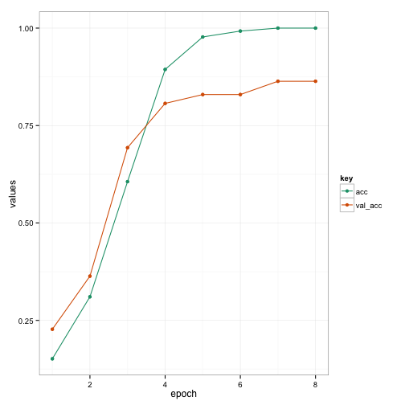
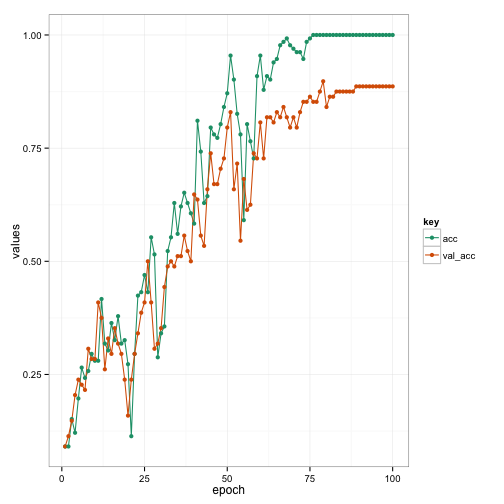

results_slides
========================================================
author: 
date: 

CNN model
========================================================

1. 4 x 4 convolution
2. 4 x 4 convolution
3. 2 x 4 max-pooling
4. three pairs of 
    - 4 x 4 convolution
    - 2 x 2 max-pooling
5. A dense layer of 128 units
6. A dense layer of 11 units (for classification)

Each layer uses ReLU for the activation, except the final classification later, which uses softmax.

RNN model
========================================================
- first uses a convolution component, similar to the CNN model, to reduce the size of the spectrogram in the frequency domain
    - reduce the frequency domain by a factor of approximately 2^6 and the time domain by a factor of 4
- then, an LSTM with 256 units is used to iterate through the time domain
- final layer of LSTM fed into a fully connected layer reducing this to 11 modes, which as input to the softmax function for classification

CNN Initial Settings
========================================================
- train on six speakers, test on four speakers
- settings
  - batch size - 4
  - epochs - 12
  - loss function - categorical-cross-entropy
  - optimiser - adadelta
  
CNN Results
=========================================================
- ran six times
  - 5 results in 0.875-0.9432
  - 1 result of 0.0909
  
 

Cross-Validation
========================================================
- LOOCV
  - 5 folds have test accuracy in 0.8636 - 1
  - 5 folds have test accuracy 0.0909
  
  
Dropout and Augmentation
========================================================
- Experiment with adding dropout layers to prevent overfitting
  - no appreciable improvement in test accuracy
- Augment the training set by introducing 10 copies of each sample, with each of these audio signals shifted by a small amount
  - some improvement in test score, but still wide range (0.8750 - 0.9659)
  - LOOCV still has five folds with 0.0909

Optimisation Tuning
========================================================
- Possible that high losses due to a learning rate that is too high
- Switch to Stochastic Gradient Descent, run for 20 epochs
- LOOCV average test accuracy 0.8636
- Test accuracy in the folds ranged from 0.4545 to 1.

RNN results
========================================================
- One run on unaugmented data using SGD optimiser and 100 epochs
- Test accuracy of 0.8864

 

